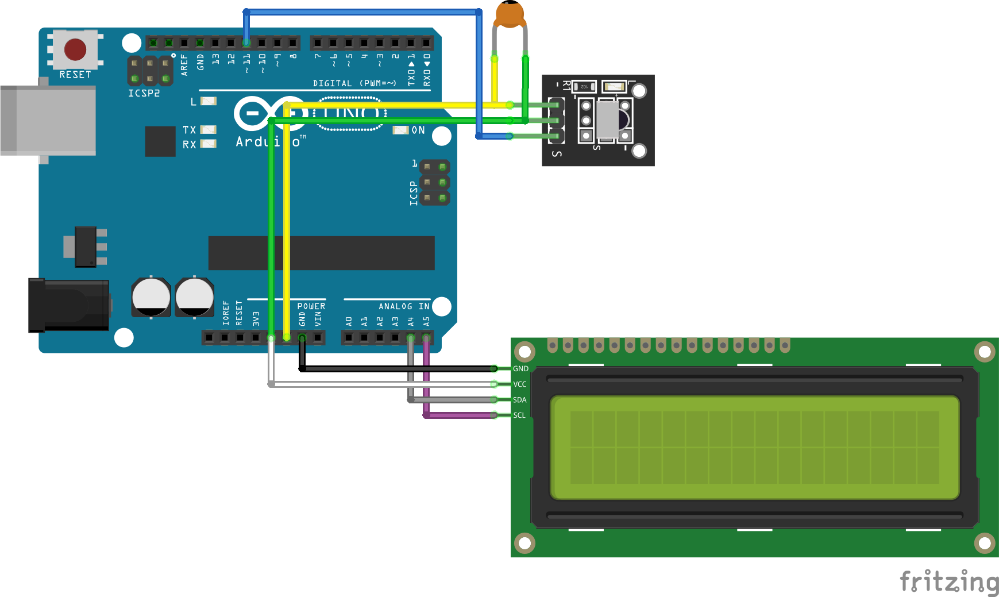

# Infrared Signal LCD Display

This Arduino Uno R3 project creates a device that displays Infrared Signal Data
to an LCD1602 I2C module. It uses a KY-022 Infrared Receiver to read in signals.

## Arduino Wiring Diagram

