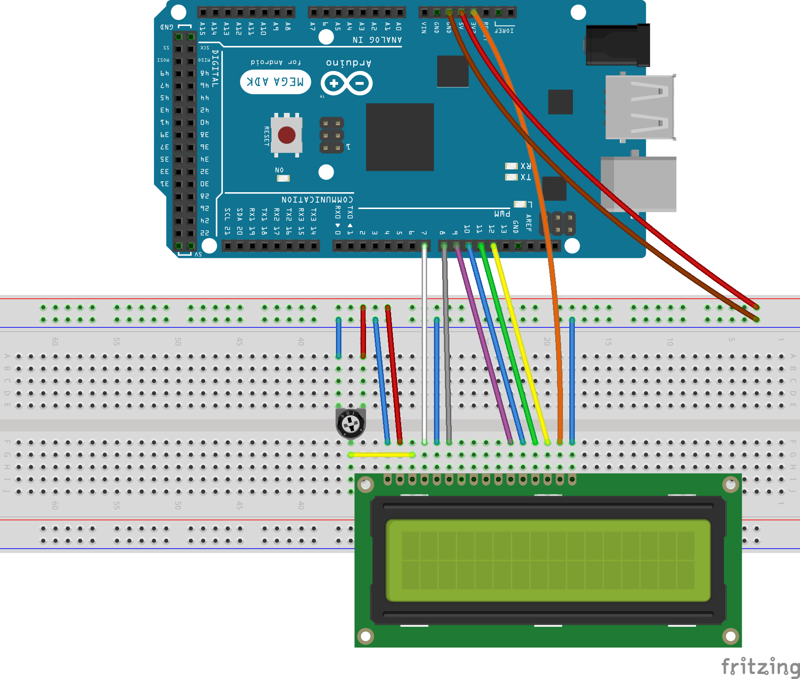
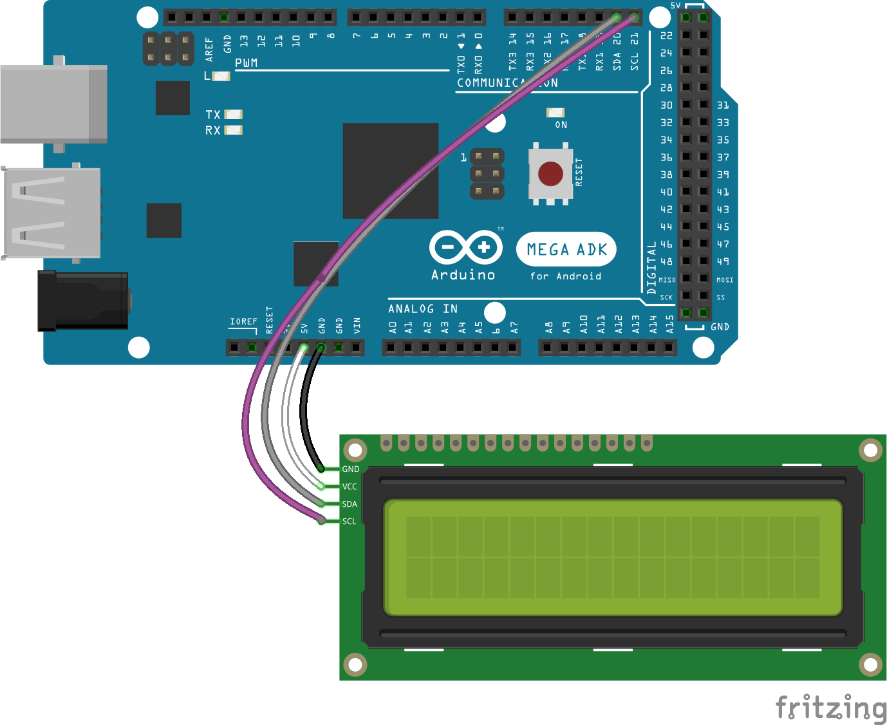
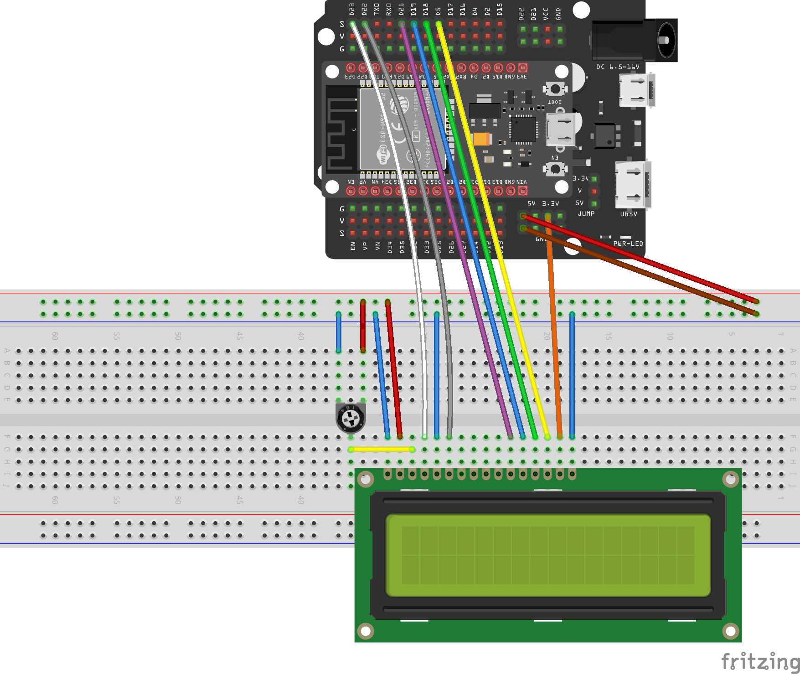
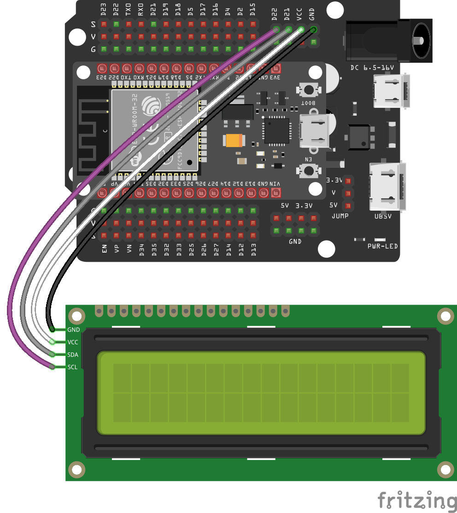

# LCD Comparison

This project looks at the wiring of ESP32 and Arduino Mega microcontroller
boards to 16x2 LCD modules with and without I2C.

## Mega to LCD Module

## Mega to LCD Module using I2C

## ESP32 to LCD Module

## ESP32 to LCD Module using I2C

